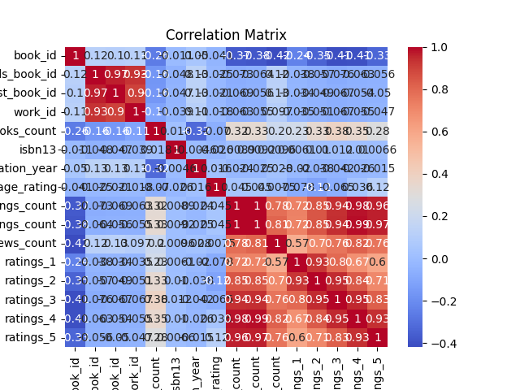

# Automated Analysis

## Dataset Overview
|                           |   count |   unique | top                                                                                      |   freq |            mean |              std |            min |             25% |              50% |             75% |              max |
|:--------------------------|--------:|---------:|:-----------------------------------------------------------------------------------------|-------:|----------------:|-----------------:|---------------:|----------------:|-----------------:|----------------:|-----------------:|
| book_id                   |   10000 |      nan | nan                                                                                      |    nan |  5000.5         |   2886.9         |     1          |  2500.75        |   5000.5         |  7500.25        |  10000           |
| goodreads_book_id         |   10000 |      nan | nan                                                                                      |    nan |     5.2647e+06  |      7.57546e+06 |     1          | 46275.8         | 394966           |     9.38223e+06 |      3.32886e+07 |
| best_book_id              |   10000 |      nan | nan                                                                                      |    nan |     5.47121e+06 |      7.82733e+06 |     1          | 47911.8         | 425124           |     9.63611e+06 |      3.55342e+07 |
| work_id                   |   10000 |      nan | nan                                                                                      |    nan |     8.64618e+06 |      1.17511e+07 |    87          |     1.00884e+06 |      2.71952e+06 |     1.45177e+07 |      5.63996e+07 |
| books_count               |   10000 |      nan | nan                                                                                      |    nan |    75.7127      |    170.471       |     1          |    23           |     40           |    67           |   3455           |
| isbn                      |    9300 |     9300 | 439023483                                                                                |      1 |   nan           |    nan           |   nan          |   nan           |    nan           |   nan           |    nan           |
| isbn13                    |    9415 |      nan | nan                                                                                      |    nan |     9.75504e+12 |      4.42862e+11 |     1.9517e+08 |     9.78032e+12 |      9.78045e+12 |     9.78083e+12 |      9.79001e+12 |
| authors                   |   10000 |     4664 | Stephen King                                                                             |     60 |   nan           |    nan           |   nan          |   nan           |    nan           |   nan           |    nan           |
| original_publication_year |    9979 |      nan | nan                                                                                      |    nan |  1981.99        |    152.577       | -1750          |  1990           |   2004           |  2011           |   2017           |
| original_title            |    9415 |     9274 |                                                                                          |      5 |   nan           |    nan           |   nan          |   nan           |    nan           |   nan           |    nan           |
| title                     |   10000 |     9964 | Selected Poems                                                                           |      4 |   nan           |    nan           |   nan          |   nan           |    nan           |   nan           |    nan           |
| language_code             |    8916 |       25 | eng                                                                                      |   6341 |   nan           |    nan           |   nan          |   nan           |    nan           |   nan           |    nan           |
| average_rating            |   10000 |      nan | nan                                                                                      |    nan |     4.00219     |      0.254427    |     2.47       |     3.85        |      4.02        |     4.18        |      4.82        |
| ratings_count             |   10000 |      nan | nan                                                                                      |    nan | 54001.2         | 157370           |  2716          | 13568.8         |  21155.5         | 41053.5         |      4.78065e+06 |
| work_ratings_count        |   10000 |      nan | nan                                                                                      |    nan | 59687.3         | 167804           |  5510          | 15438.8         |  23832.5         | 45915           |      4.94236e+06 |
| work_text_reviews_count   |   10000 |      nan | nan                                                                                      |    nan |  2919.96        |   6124.38        |     3          |   694           |   1402           |  2744.25        | 155254           |
| ratings_1                 |   10000 |      nan | nan                                                                                      |    nan |  1345.04        |   6635.63        |    11          |   196           |    391           |   885           | 456191           |
| ratings_2                 |   10000 |      nan | nan                                                                                      |    nan |  3110.89        |   9717.12        |    30          |   656           |   1163           |  2353.25        | 436802           |
| ratings_3                 |   10000 |      nan | nan                                                                                      |    nan | 11475.9         |  28546.4         |   323          |  3112           |   4894           |  9287           | 793319           |
| ratings_4                 |   10000 |      nan | nan                                                                                      |    nan | 19965.7         |  51447.4         |   750          |  5405.75        |   8269.5         | 16023.5         |      1.4813e+06  |
| ratings_5                 |   10000 |      nan | nan                                                                                      |    nan | 23789.8         |  79768.9         |   754          |  5334           |   8836           | 17304.5         |      3.01154e+06 |
| image_url                 |   10000 |     6669 | https://s.gr-assets.com/assets/nophoto/book/111x148-bcc042a9c91a29c1d680899eff700a03.png |   3332 |   nan           |    nan           |   nan          |   nan           |    nan           |   nan           |    nan           |
| small_image_url           |   10000 |     6669 | https://s.gr-assets.com/assets/nophoto/book/50x75-a91bf249278a81aabab721ef782c4a74.png   |   3332 |   nan           |    nan           |   nan          |   nan           |    nan           |   nan           |    nan           |

## Missing Values
|                           |    0 |
|:--------------------------|-----:|
| book_id                   |    0 |
| goodreads_book_id         |    0 |
| best_book_id              |    0 |
| work_id                   |    0 |
| books_count               |    0 |
| isbn                      |  700 |
| isbn13                    |  585 |
| authors                   |    0 |
| original_publication_year |   21 |
| original_title            |  585 |
| title                     |    0 |
| language_code             | 1084 |
| average_rating            |    0 |
| ratings_count             |    0 |
| work_ratings_count        |    0 |
| work_text_reviews_count   |    0 |
| ratings_1                 |    0 |
| ratings_2                 |    0 |
| ratings_3                 |    0 |
| ratings_4                 |    0 |
| ratings_5                 |    0 |
| image_url                 |    0 |
| small_image_url           |    0 |

## Insights
Based on the summary of the dataset you provided, here are some insights and observations:

### General Overview
- The dataset contains **10,000 entries** (likely representing books), with various attributes related to each book.
- Key identifiers for each book include `book_id`, `goodreads_book_id`, `best_book_id`, and `work_id`.

### Columns and Their Statistics
1. **Identifiers:**
   - `book_id`, `goodreads_book_id`, `best_book_id`, and `work_id` are unique identifiers with no missing values.

2. **Book Attributes:**
   - `books_count`: The average number of books is approximately **75.71**, with a maximum of **3455**.
   - `isbn` and `isbn13`: There are **700** and **585** missing values respectively, indicating some books do not have these codes.

3. **Authors:**
   - There are **4664 unique authors** in the dataset, with "Stephen King" being the most frequently mentioned (60 times).

4. **Publication Year:**
   - The average original publication year is approximately **1982**, with a range from **-1750** to **2017**. The negative value suggests some records may have erroneous dates or represent ancient texts.

5. **Titles:**
   - `original_title` has **585** missing values, and the dataset contains **9274 unique titles**.

6. **Language:**
   - There are **25 unique languages** represented, with **1084 missing values** in `language_code`. The most common language is English (`eng`), found in **6341 entries**.

7. **Ratings:**
   - The average rating across all books is approximately **4.00**, with a standard deviation of **0.25**. Ratings seem to be generally favorable.
   - `ratings_count` has an average of **54001**, showing substantial engagement with the books.

8. **Rating Distribution:**
   - The distribution of ratings from 1 to 5 shows the following averages:
     - 1-star: **1345.04**
     - 2-star: **3110.89**
     - 3-star: **11475.89**
     - 4-star: **19965.70**
     - 5-star: **23789.81**
   - The highest ratings (4 and 5 stars) have significantly higher counts, indicating a tendency for positive reviews.

9. **Text Reviews:**
   - The average number of text reviews is **2919.96**, with a maximum of **155254**, suggesting some books are extensively reviewed.

10. **Image URLs:**
    - Both `image_url` and `small_image_url` contain **10,000 entries** with **6669 unique URLs**, indicating some books share cover images.

### Missing Values
- There are some notable missing values:
  - **ISBNs** (both `isbn` and `isbn13`) are missing for a significant number of entries.
  - **Original publication year** has 21 missing values, which could affect analyses concerning publication trends.
  - **Language codes** have the highest missing count, which may limit demographic insights based on language.

### Recommendations for Analysis
1. **Data Cleaning:**
   - Address missing values, particularly for ISBNs and language codes. Consider imputation strategies or removing entries with critical missing information if necessary.
  
2. **Exploratory Data Analysis (EDA):**
   - Analyze the distribution of ratings, publication years, and languages to identify trends in book popularity and diversity.

3. **Author Insights:**
   - Investigate the impact of different authors on ratings and review counts.

4. **Publication Trends:**
   - Explore how the publication year affects the average rating and the number of ratings received.

5. **Visualizations:**
   - Create visual representations (like histograms or box plots) to illustrate distributions of ratings, publication years, and reviews.

This analysis can help in understanding patterns within the dataset and guide further investigations into book characteristics and their reception.

## Visualizations
