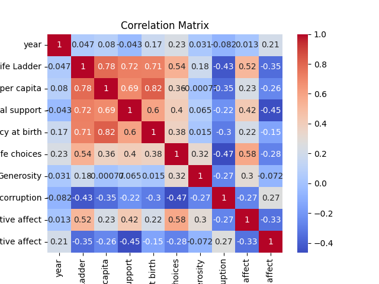

# Automated Analysis

## Dataset Overview
|                                  |   count |   unique | top     |   freq |           mean |         std |      min |       25% |       50% |        75% |      max |
|:---------------------------------|--------:|---------:|:--------|-------:|---------------:|------------:|---------:|----------:|----------:|-----------:|---------:|
| Country name                     |    2363 |      165 | Lebanon |     18 |  nan           | nan         |  nan     |  nan      |  nan      |  nan       |  nan     |
| year                             |    2363 |      nan | nan     |    nan | 2014.76        |   5.05944   | 2005     | 2011      | 2015      | 2019       | 2023     |
| Life Ladder                      |    2363 |      nan | nan     |    nan |    5.48357     |   1.12552   |    1.281 |    4.647  |    5.449  |    6.3235  |    8.019 |
| Log GDP per capita               |    2335 |      nan | nan     |    nan |    9.39967     |   1.15207   |    5.527 |    8.5065 |    9.503  |   10.3925  |   11.676 |
| Social support                   |    2350 |      nan | nan     |    nan |    0.809369    |   0.121212  |    0.228 |    0.744  |    0.8345 |    0.904   |    0.987 |
| Healthy life expectancy at birth |    2300 |      nan | nan     |    nan |   63.4018      |   6.84264   |    6.72  |   59.195  |   65.1    |   68.5525  |   74.6   |
| Freedom to make life choices     |    2327 |      nan | nan     |    nan |    0.750282    |   0.139357  |    0.228 |    0.661  |    0.771  |    0.862   |    0.985 |
| Generosity                       |    2282 |      nan | nan     |    nan |    9.77213e-05 |   0.161388  |   -0.34  |   -0.112  |   -0.022  |    0.09375 |    0.7   |
| Perceptions of corruption        |    2238 |      nan | nan     |    nan |    0.743971    |   0.184865  |    0.035 |    0.687  |    0.7985 |    0.86775 |    0.983 |
| Positive affect                  |    2339 |      nan | nan     |    nan |    0.651882    |   0.10624   |    0.179 |    0.572  |    0.663  |    0.737   |    0.884 |
| Negative affect                  |    2347 |      nan | nan     |    nan |    0.273151    |   0.0871311 |    0.083 |    0.209  |    0.262  |    0.326   |    0.705 |

## Missing Values
|                                  |   0 |
|:---------------------------------|----:|
| Country name                     |   0 |
| year                             |   0 |
| Life Ladder                      |   0 |
| Log GDP per capita               |  28 |
| Social support                   |  13 |
| Healthy life expectancy at birth |  63 |
| Freedom to make life choices     |  36 |
| Generosity                       |  81 |
| Perceptions of corruption        | 125 |
| Positive affect                  |  24 |
| Negative affect                  |  16 |

## Insights
Thank you for providing the summary of the dataset along with the information about missing values. Here's a breakdown of the dataset and some potential steps for analysis:

### Dataset Overview

1. **Country Name**:
   - Total Entries: 2363
   - Unique Countries: 165
   - Most Frequent Country: Lebanon (18 occurrences)

2. **Year**:
   - Range of Years: 2005 to 2023
   - Mean Year: Approximately 2014.76
   - Standard Deviation: 5.06 (indicating a spread in the years)

3. **Life Ladder**:
   - Mean: 5.48
   - Standard Deviation: 1.13
   - Range: 1.281 to 8.019

4. **Log GDP per Capita**:
   - Mean: 9.40
   - Standard Deviation: 1.15
   - Range: 5.527 to 11.676
   - Missing Values: 28 entries

5. **Social Support**:
   - Mean: 0.81
   - Standard Deviation: 0.12
   - Range: 0.228 to 0.987
   - Missing Values: 13 entries

6. **Healthy Life Expectancy at Birth**:
   - Mean: 63.40 years
   - Standard Deviation: 6.84
   - Range: 6.72 to 74.6
   - Missing Values: 63 entries

7. **Freedom to Make Life Choices**:
   - Mean: 0.75
   - Standard Deviation: 0.14
   - Range: 0.228 to 0.985
   - Missing Values: 36 entries

8. **Generosity**:
   - Mean: 0.0001 (very close to zero)
   - Standard Deviation: 0.16
   - Range: -0.34 to 0.7
   - Missing Values: 81 entries

9. **Perceptions of Corruption**:
   - Mean: 0.74
   - Standard Deviation: 0.18
   - Range: 0.035 to 0.983
   - Missing Values: 125 entries

10. **Positive Affect**:
    - Mean: 0.65
    - Standard Deviation: 0.11
    - Range: 0.179 to 0.884
    - Missing Values: 24 entries

11. **Negative Affect**:
    - Mean: 0.27
    - Standard Deviation: 0.09
    - Range: 0.083 to 0.705
    - Missing Values: 16 entries

### Handling Missing Values

Given the number of missing values in several columns, you may consider the following approaches:

- **Imputation**: Fill missing values using the mean, median, or mode, depending on the distribution of the data.
- **Removal**: If missing values are not significant, consider dropping those entries.
- **Analysis of Missingness**: Investigate if the missing values are random or if there's a pattern that could be informative.

### Potential Analyses

1. **Correlation Analysis**: Investigate correlations between variables, particularly those that are continuous (e.g., Log GDP per Capita, Life Ladder).
2. **Trend Analysis**: Analyze how the indicators change over the years.
3. **Country Comparisons**: Compare life satisfaction scores (Life Ladder) across different countries or regions.
4. **Predictive Modeling**: Use regression techniques to predict life satisfaction based on other factors (e.g., GDP, social support).

### Next Steps

- Decide on the approach for handling missing values.
- Perform exploratory data analysis (EDA) to visualize distributions and relationships between variables.
- Formulate specific questions or hypotheses you would like to test with this dataset.

If you have any specific questions or analyses you would like to conduct, feel free to ask!

## Visualizations
