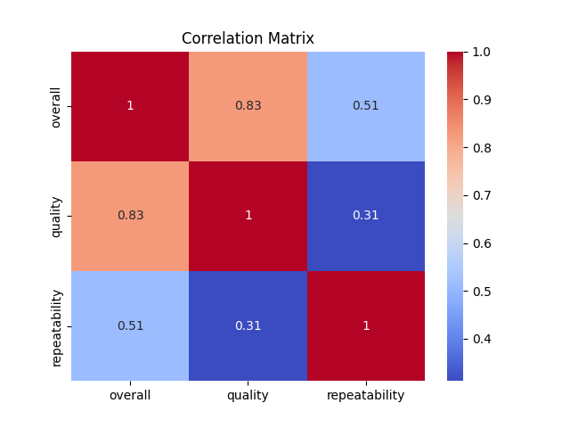

# Automated Analysis

## Dataset Overview
|               |   count |   unique | top               |   freq |      mean |        std |   min |   25% |   50% |   75% |   max |
|:--------------|--------:|---------:|:------------------|-------:|----------:|-----------:|------:|------:|------:|------:|------:|
| date          |    2553 |     2055 | 21-May-06         |      8 | nan       | nan        |   nan |   nan |   nan |   nan |   nan |
| language      |    2652 |       11 | English           |   1306 | nan       | nan        |   nan |   nan |   nan |   nan |   nan |
| type          |    2652 |        8 | movie             |   2211 | nan       | nan        |   nan |   nan |   nan |   nan |   nan |
| title         |    2652 |     2312 | Kanda Naal Mudhal |      9 | nan       | nan        |   nan |   nan |   nan |   nan |   nan |
| by            |    2390 |     1528 | Kiefer Sutherland |     48 | nan       | nan        |   nan |   nan |   nan |   nan |   nan |
| overall       |    2652 |      nan | nan               |    nan |   3.04751 |   0.76218  |     1 |     3 |     3 |     3 |     5 |
| quality       |    2652 |      nan | nan               |    nan |   3.20928 |   0.796743 |     1 |     3 |     3 |     4 |     5 |
| repeatability |    2652 |      nan | nan               |    nan |   1.49472 |   0.598289 |     1 |     1 |     1 |     2 |     3 |

## Missing Values
|               |   0 |
|:--------------|----:|
| date          |  99 |
| language      |   0 |
| type          |   0 |
| title         |   0 |
| by            | 262 |
| overall       |   0 |
| quality       |   0 |
| repeatability |   0 |

## Insights
Based on the summary of the dataset and the missing values you've provided, here are some insights and recommendations for analysis and potential data cleaning:

### Dataset Overview:
1. **Date**:
   - Total entries: 2553
   - Unique dates: 2055
   - Missing values: 99
   - The presence of missing dates could affect time series analyses. Consider imputing these values or analyzing the impact of their absence.

2. **Language**:
   - Total entries: 2652
   - Unique languages: 11
   - No missing values. This column appears to be complete.

3. **Type**:
   - Total entries: 2652
   - Unique types: 8
   - No missing values. This column is also complete.

4. **Title**:
   - Total entries: 2652
   - Unique titles: 2312
   - No missing values. This column has a high variety of entries.

5. **By (presumably the creator or director)**:
   - Total entries: 2390
   - Unique creators: 1528
   - Missing values: 262
   - The missing values in this column may need attention, especially if "by" is significant for analysis (like identifying trends in creators).

6. **Overall Rating**:
   - Total entries: 2652
   - Mean: 3.05
   - Standard Deviation: 0.76
   - No missing values. This suggests that overall ratings are complete.

7. **Quality Rating**:
   - Total entries: 2652
   - Mean: 3.21
   - Standard Deviation: 0.80
   - No missing values, indicating completeness.

8. **Repeatability**:
   - Total entries: 2652
   - Mean: 1.49
   - Standard Deviation: 0.60
   - No missing values. This suggests the repeatability data is fully available.

### Recommendations:
1. **Handling Missing Values**:
   - For the **date** column, consider whether the missing dates can be filled with a reasonable imputation method (like using the mean date or the mode if applicable).
   - For the **by** column, investigate the reasons for missing creator information. If they are significant, consider using techniques like imputation based on the type or title of the entry.

2. **Exploratory Data Analysis (EDA)**:
   - Perform visualizations to understand the distribution of ratings (overall, quality, repeatability) and the relationship between them.
   - Analyze trends over time (using the date column) and see if certain creators or types have higher ratings.

3. **Statistical Analysis**:
   - Conduct correlation analysis to study relationships between ratings and other variables (e.g., type, by).
   - Consider hypothesis testing to determine if certain types or creators significantly differ in terms of ratings.

4. **Modeling**:
   - If you're interested in predictive modeling, consider using the complete columns to predict missing values in the 'by' column or to predict ratings based on other features.

5. **Data Cleaning**:
   - Ensure any duplicates in the 'title' or 'by' columns are handled appropriately if they exist, as they can skew analyses.

By following these recommendations, you will be able to derive meaningful insights from the dataset and improve the overall quality of your analysis.

## Visualizations
